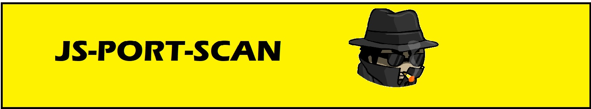

<div align="center">
  
</div>

# JS-PORT-SCAN FOR NODE.JS
<p align="center">
   
   
   
   
   
   
   
</p>

<p align="center">
   
   
   
</p>

<p align="center">
  <a href="https://www.linkedin.com/in/heleno-betini-2b3016175/" target="_blank">
    
  </a>
  <a href="https://github.com/rhaymisonbetini" target="_blank">
    
  </a>
</p>

Javascript-based library for port scanning, TCP calls, UDP, IPtracer, Discover host by ip and ip by host

## INSTALL

```
npm install js-port-scan
```

### HOW TO USE 

```javascript
const JsScan = require('js-port-scan')
```

Now you can instantiate a new Scanner class. This class extends the Scaner class that performs all the functionality

```javascript
const jsScan =  new JsScan()

```

### AVAILABLE FUNCTIONS

### scanPorts

This method performs a scanner on a series of ports of a given host <br/>
using the handShakeTcp method as the function center.

```javascript
/**
* This method scanner a host with a interval for a inital end final given ports.
* A loopg was created to scanning the interval with handShakeTcp method.
 * Depens on your connetion and powers.
* @param {string} host ex: www.facebook.com
* @param {number} init initial (include) port
* @param {number} end final ( include ) final port
* @param {boolean} consoler display results in console
* @returns {Promise<Array<object>>}
*/
async scanPorts(host, init = 0, end = 1000, consoler = false)
```

The return of this function will be an array containing 1 object with the start <br/>
and end date of the scanner an array of cobjects containing the ports that were <br/>
successfully connected an array of objects containing ports that failed to connect <br/>
successfully

return exemple:
``` javascript
[
 { init: '2023-03-23 15:27:18', end: '2023-03-23 15:28:00' },
  [
    {
      connected: true,
      msg: 'Established a TCP connection with www.youtube.com:80',        
      reason: ''
    }
  ],
  [
    {
      connected: false,
      msg: 'Erro to established a TCP connection with www.youtube.com:81',
      reason: 'ETIMEDOUT'
    },
    {
      connected: false,
      msg: 'Erro to established a TCP connection with www.youtube.com:82',
      reason: 'ETIMEDOUT'
    }
  ]
]
```

### handShakeTcp
This class performs a TCP handshake call to validate a connection<br/>
It is asynchronous and retrives an object.

```javascript
/**
* this handShake make a tcp connection to a given host and port
* @param {number} port Port should be >= 0 and < 65536
* @param {string} host ip or dns
* @param {boolean} consoler display results in console
* @returns {Promise<{ connected: 0, msg: '', reason: '' }>}
*/
async handShakeTcp(port, host, consoler = false): 
```
Explanation of the return:
* connected: true for success and false for problems connecting,
* msg: Message generated by js-port-scaner about the process
* reason: Filled in case an error occurs

### udpScanner
This method is simple. Since UDP calls do not expect any return, 
this method will only return an error if there is a problem.

```javascript
/**
* This method create a updCall. Upd call do not need return from the destination.
* So is not possible verify the return of the connection, only if we have error.
* @param {number} port
* @param {string} host
* @param {string} stringBytes
* @returns {Promise<any>}
*/
async udpScanner(port, host, stringBytes = null) 
```

### tracer
This function provides a tracer to destinantion
library-based  nodejs-traceroute

```javascript
/**
* This function create a trace untill the destination
* @param {string } host ex: www.facebook.com
* @param {boolean} consoler  if you want to display in console every tracer
* @returns {Promisse<Array<string>>}
*/
```

return exemple:

```json
{"mesg":[{"trace":"{\"hop\":1,\"rtt1\":\"1 ms\",\"rtt2\":\"1 ms\",\"rtt3\":\"<1 ms\",\"ip\":\"localhost\"}"},
{"trace":"{\"hop\":2,\"rtt1\":\"15 ms\",\"rtt2\":\"1 ms\",\"rtt3\":\"1 ms\",\"ip\":\"10.255.255.5\"}"},
{"trace":"{\"hop\":3,\"rtt1\":\"2 ms\",\"rtt2\":\"3 ms\",\"rtt3\":\"2 ms\",\"ip\":\"198.19.0.225\"}"},
{"trace":"{\"hop\":4,\"rtt1\":\"5 ms\",\"rtt2\":\"3 ms\",\"rtt3\":\"2 ms\",\"ip\":\"198.18.0.33\"}"},
{"finish":"code 0"}]}
```

### ipTracer
This method pings the destination and creates a tracer. 
it returns a string informed by the ping process

```javascript
/**
* create ip ping tracer with a 4 call
* @param {string} host
* @param {number} ttl
* @returns {Promise<string>}
*/
async ipTracer(host)
```

return example:
```shell
Disparando 157.240.216.35 com 32 bytes de dados:
Resposta de 157.240.216.35: bytes=32 tempo=18ms TTL=54       
Resposta de 157.240.216.35: bytes=32 tempo=20ms TTL=54       
Resposta de 157.240.216.35: bytes=32 tempo=18ms TTL=54       
Resposta de 157.240.216.35: bytes=32 tempo=18ms TTL=54       

Estatisticas do Ping para 157.240.216.35:
Pacotes: Enviados = 4, Recebidos = 4, Perdidos = 0 (0% deperda),
Aproximar um n mero redondo de vezes em milissegundos:       
Minimo = 18ms, M ximo = 20ms, M dia = 18ms
```

### getIpByHost

This method return an ip from a given host

```javascript
/**
* This function retuns a ipv4 for a given host
* @param {string} host 
* @returns {Promise<string>}
*/
async getIpByHost(host) 
```

### getHostByIp

This method return a host from a given IP

```javascript
/**
* This function retuns a host for a given ip and port
* @param {string} host 
* @param {number} port
* @returns {Promise<string>}
*/
async getHostByIp(host, port) 
```